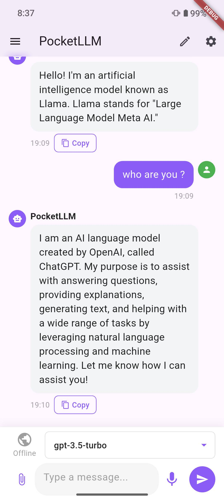
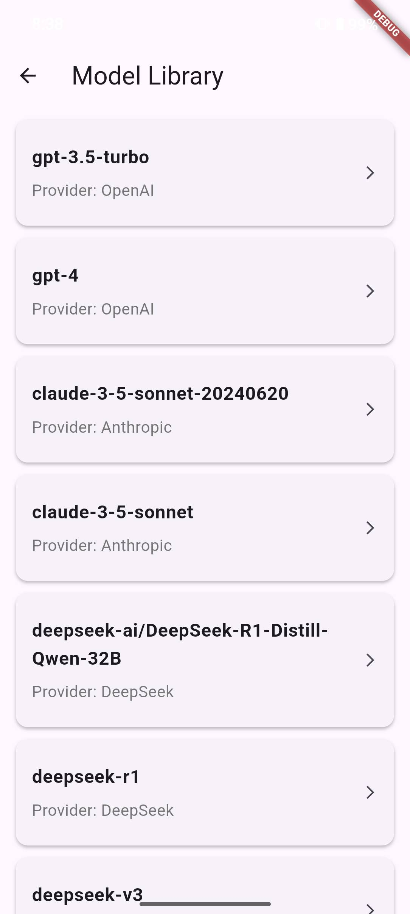

# PocketLLM

<div align="center">
  
  <h3>A Modern Flutter-based Chat Application with LLM Integration</h3>
</div>

PocketLLM is a sophisticated Flutter-based chat application that harnesses the power of large language models to deliver intelligent conversational experiences. Built with modern architecture and best practices, it offers a seamless cross-platform solution for AI-powered conversations.

## 📱 App Screenshots

<div align="center">
  
  
  
</div>

## ✨ Core Features

### 🤖 AI Model Support
- Multi-model support (Ollama, OpenAI, Anthropic, LM Studio)
- Local-first architecture for data privacy
- Custom model configuration
- Easy model switching
- Real-time model status monitoring
- API key management for different providers

### 💬 Chat Interface
- Real-time AI conversations with message streaming
- Markdown rendering for formatted responses
- One-click message copying
- Persistent chat history
- Smart typing indicators
- File attachments (images, documents)
- Voice input capabilities
- Context-aware suggested prompts
- Code syntax highlighting

### 🌐 Web Integration
- Optional web search via Tavily API
- Toggle between online/offline modes
- Web search results in AI responses
- Smart context incorporation

### ⚙️ System Features
- Comprehensive device information
- Real-time memory monitoring
- Storage usage tracking
- Termux integration support
- Performance metrics dashboard
- System health monitoring

### 🔐 Authentication & Security
- Email/password authentication
- Secure account management
- Google Sign-in support (planned)
- Session management
- Local data encryption
- Secure API key storage
- Private chat history

### 🎨 User Interface
- Modern, clean design
- Dark/Light mode support
- Responsive layout
- Custom app bar with model selector
- Intuitive sidebar navigation
- Progress indicators
- Smooth animations
- Cross-platform compatibility

### 💾 Data Management
- Local chat history storage
- Secure API key management
- Model configuration persistence
- User preferences storage
- Efficient data handling

### 🛠️ Developer Features
- Open source codebase
- Comprehensive documentation
- Custom model integration support
- Extensible architecture
- API configuration options
- Error handling system
- Network status monitoring

## 🛠️ Tech Stack

- **Frontend Framework**: Flutter 3.27.4
- **Programming Language**: Dart 3.6.2
- **Backend Services**: Supabase
- **State Management**: Provider
- **Authentication**: Supabase Auth
- **Storage**: Supabase Storage
- **UI Components**: Material Design

## 📋 Prerequisites

Before you begin, ensure you have met the following requirements:

- Flutter SDK (3.27.4 or later)
- Dart SDK (3.6.2 or later)
- Java Development Kit (JDK) 17 or later
- Android Studio / VS Code with Flutter extensions
- A Supabase account for backend services
- Git for version control

## 📦 Dependencies

Key packages used in this project:

```yaml
dependencies:
  flutter_svg: ^2.0.7        # SVG rendering
  image_picker: ^1.0.4       # Image selection
  animated_text_kit: ^4.2.3  # Text animations
  flutter_markdown: ^0.6.0   # Markdown rendering
  supabase_flutter: ^1.10.25 # Supabase integration
  flutter_secure_storage: ^9.0.0 # Secure storage
```

For a complete list of dependencies, check the `pubspec.yaml` file.

## 🚀 Getting Started

1. **Clone the repository**
   ```bash
   git clone https://github.com/yourusername/pocketllm.git
   cd pocketllm
   ```

2. **Install dependencies**
   ```bash
   flutter pub get
   ```

3. **Configure Supabase**
   - Create a new project in Supabase
   - Copy your project URL and anon key
   - Update the configuration in `lib/services/auth_service.dart`

4. **Run the application**
   ```bash
   flutter run
   ```

## 📁 Project Structure

```
lib/
├── component/       # Core UI components
│   ├── appbar/     # Custom app bar components
│   ├── chat_interface.dart
│   └── sidebar.dart
├── pages/          # Application screens
│   ├── auth/      # Authentication related pages
│   └── settings/  # Settings pages
├── services/       # Business logic and API services
│   ├── auth_service.dart
│   └── termux_service.dart
└── widgets/        # Reusable UI widgets
```

## 🤝 Contributing

We welcome contributions to PocketLLM! Here's how you can help:

1. Fork the repository
2. Create your feature branch (`git checkout -b feature/AmazingFeature`)
3. Commit your changes (`git commit -m 'Add some AmazingFeature'`)
4. Push to the branch (`git push origin feature/AmazingFeature`)
5. Open a Pull Request

Please read our [Contributing Guidelines](CONTRIBUTING.md) for details on our code of conduct and the process for submitting pull requests.

## 🔒 Security

If you discover any security-related issues, please email security@pocketllm.com instead of using the issue tracker. All security vulnerabilities will be promptly addressed.

## 📄 License

This project is licensed under the MIT License - see the [LICENSE](LICENSE) file for details.

## 💬 Support

For support and questions:
- Open an issue in the repository
- Join our [Discord community](https://discord.gg/pocketllm)
- Follow us on [Twitter](https://twitter.com/pocketllm)

## 🙏 Acknowledgments

- Thanks to all contributors who have helped shape PocketLLM
- Special thanks to the Flutter and Supabase teams for their amazing frameworks
- Icons and design resources from [Flutter Material Design](https://material.io/design)

---

<div align="center">
Made with ❤️ by the PocketLLM Team
</div>